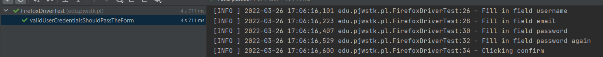
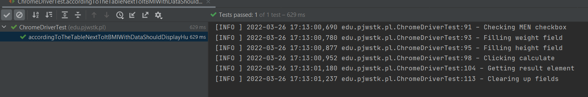

# Test scenarios

Two websites were used for testing
[Amazon registration form](https://www.amazon.pl/ap/register?openid.pape.max_auth_age=0&openid.return_to=https%3A%2F%2Fwww.amazon.pl%2F%3F_encoding%3DUTF8%26ref_%3Dnav_custrec_newcust&openid.identity=http%3A%2F%2Fspecs.openid.net%2Fauth%2F2.0%2Fidentifier_select&openid.assoc_handle=plflex&openid.mode=checkid_setup&openid.claimed_id=http%3A%2F%2Fspecs.openid.net%2Fauth%2F2.0%2Fidentifier_select&openid.ns=http%3A%2F%2Fspecs.openid.net%2Fauth%2F2.0&)
and
[BMI Calculator](https://calc.pl/zdrowie/bmi)

## Test scenarios for registering on Amazon using FirefoxDriver

### `validUserCredentialsShouldPassTheForm`
The method tests whether the form can be validated after all inputs have been filled in. After going to the page after registration the test should intercept the message asking to enter the code sent by the page to the email.
Screen after successful registration

### `badlyRepeatedPasswordShouldNotLetTheFormPass`
The method tests whether you can proceed to registration confirmation with a code after entering a badly repeated password

### `invalidEmailCredentialsShouldNotLetTheFormPass`
The method tests whether you can proceed to confirm the registration with a code after entering an invalid one. That is, whether the site is able to validate the email.

### `firstNameFieldShouldNotBeEmpty`
I am testing a method to see if you can approve a registration form without filling in the first name field.

### `passwordFieldShouldNotBeEmpty`
I'm testing a method to see if you can approve a registration form without filling out the password field.

### `siteShouldDisplayAlertWhenEmailIsUsed`
The method tests if the form registers the user if the email is already in use

 
## Test scenarios for calculating BMI on calc.pl using ChromeDriver

### `allFieldsFilledShouldDisplayBMI`
The method checks whether the result is displayed after all fields have been filled in

### `bmiWithProvidedDataShouldDisplay1651ForWoman`
The method checks if the program calculates correct BMI for woman, i.e. if it is 16.51, after entering the weight field to 50 and the height field to 174

### `bmiWithProvidedDataShouldDisplay661ForMen`
The method checks if the program calculates correct BMI for man, i.e. if it is 6.61, after entering the weight field to 20 and the height field to 174

### `accordingToTheTableNextToItBMIWithDataShouldDisplayHungerButItIsNot`
The method checks if the name pointing to the given indicator in the table provided next to the form is displayed correctly

### All testing classes includes methods called setUp, clearUp and closeBrowser
They are responsible for setting the driver and logger, deleting the data entered in the input fields and closing the browser after the tests have been run.

